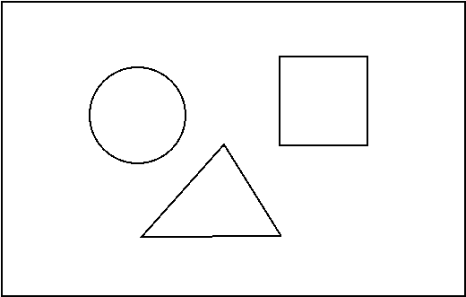

1. Sea una escena como la de la figura. La escena tiene un cuadrado, un triángulo (no tiene que ser equilatero) y un círculo. Las dimensiones y las posiciones de estas figuras en la escena pueden cambiar. Se pide, crear una estructura que sea capaz de albergar toda la información necesaria para definir la escena.

2. Crear un programa que muestre por pantalla las tres posiciones en las que aparece el texto _"tri"_ en el siguiente texto: "Tres tristes tigres comen trigo en un trigal"
3. A partir del texto "En un lugar de la Mancha, de cuyo nombre no quiero acordarme" crear un programa que muestre por pantalla dos textos: lo que hay antes de Mancha (*En un lugar de la *) y lo que hay después (*, de cuyo nombre no quiero acordarme*) .
4. Pedir al usuario que introduzca un texto por teclado y mostrar por pantalla el número de veces que aparece la vocal "a".
5. Pedir al usuario que introduzca un texto por teclado y mostrar todas las palabras que empiecen por "a".
6. Pedir al  usuario que introduzca un texto por teclado y mostrar todas las palabras que contengan al menos una "a". Para ello será necesario utilizar alguna de las funciones explicadas [aquí](http://www.cplusplus.com/reference/string/string/)
7. Crear una función que recorra un vector de números enteros positivos y devuelva un vector con aquellos números que sean primos.
8. Crear una función que devuelva un vector con los _n_ primeros números primos. El número _n_ se le debe pasar a la función como parámetro.
9. Crear una función que reciba un número entero positivo y devuelva un vector son sus factores ([ver aquí](https://matematica.fandom.com/wiki/Descomposicion_de_numeros_naturales_en_factores) que son los factores de un número natural).
